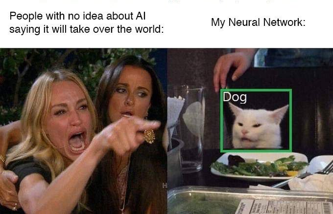

  

<h1 align="center">Hey there 👋, I'm Tariqul Islam</h1>

<h3 align="center">Machine Learning Enthusiast | Computer Vision Researcher | Aspiring Scientist</h3>

### 👨‍🔬 About Me

I’m a CSE graduate from Dhaka, building bridges between machine learning and the real world.  
From detecting diseases in salinity-resilient crops to assisting field research on climate and health, my work blends **code, data, and context**.  

I’ve:
- 🧪 Built and published a verified dataset for leaf disease classification  
- 🧠 Trained ViT & CNN models for 99.85% accuracy  
- 🎤 Supported international science communication for climate-smart agriculture  
- 📚 Taught over 150+ students Python, ML, and data science fundamentals  

I enjoy figuring things out — not just with code, but with **people, patterns, and purpose**.  
Let’s solve real problems with meaningful AI.

---

### ⚙️ Technologies I Work With

  
  
  
  
  
  
  
  

---

### 📌 Highlighted Projects

-  [Salinity-Resilient Crop Health Monitoring](https://sites.google.com/diu.edu.bd/tariqleafdiseasedetection/home)  
  → Created a 6K+ image dataset & trained ViT/CNN models for automated disease classification.

-   Mendeley (Verified by Plant Pathologist)](https://doi.org/10.17632/nym8bw5hr6.3)

---

### 📬 Want to Connect?

- 💼 [Full CV](https://drive.google.com/file/d/1zU1MAAtZJWv_weBIBWelvUp0992klrLw/view)
- 🌐 [Portfolio](https://sites.google.com/view/tariqportfolioo/about)
- 📧 Email: **trq.islm0@gmail.com**

---

  

